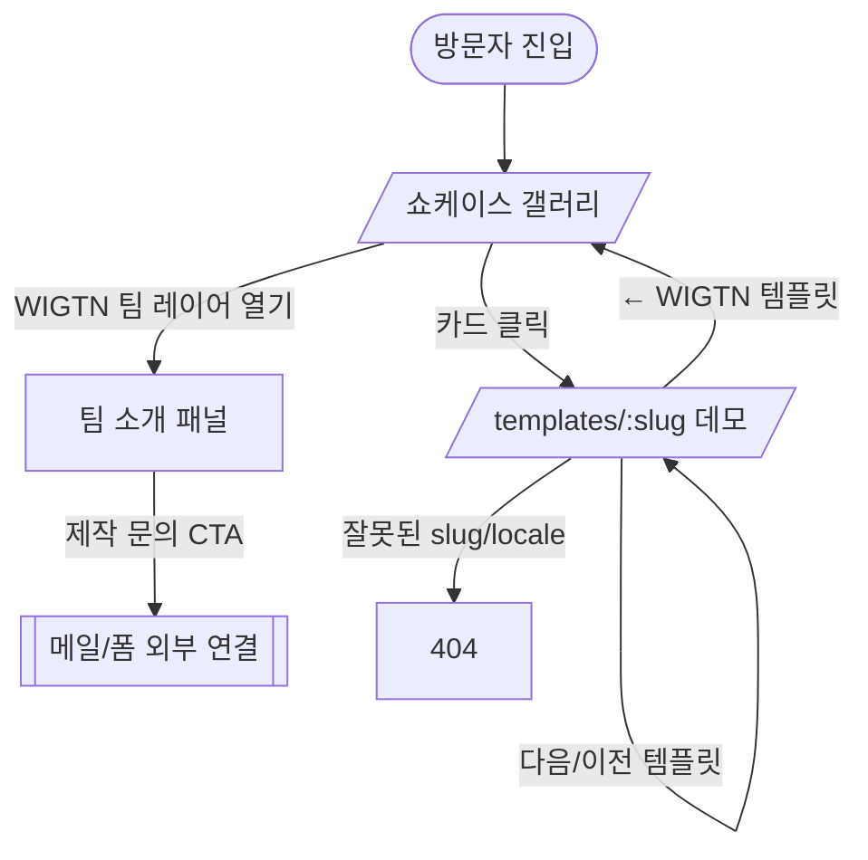

# WIGTN 템플릿 쇼케이스 (Template Showcase) PRD

> **Version**: 1.1
> **Created**: 2026-07-13
> **Status**: Draft
> **Type**: product-feature
> **Owner**: WIGTN (contact@wigtn.com)
> **Base**: 기존 `STAY HEAVEN` 단일 게스트하우스 템플릿 (Next.js 16 App Router · TS · Tailwind · next-intl · Framer Motion)
> **v1.1 변경**: WIGTN을 (숙박 특화 → ) 일반 웹에이전시로 재포지셔닝. 템플릿 셋을 숙박 3종(게스트하우스·시티호텔·한옥) + 비숙박 2종(레스토랑·포트폴리오)으로 변경(호스텔·리조트 제외). 갤러리=에디토리얼 로우, 팀 레이어=인라인 확장 확정.

---

## 1. Overview

### 1.1 Problem Statement
WIGTN은 다양한 업종의 웹을 만드는 웹에이전시다. 현재 데모 사이트는 부티크 게스트하우스 템플릿(`STAY HEAVEN`) **1개뿐**이라, 잠재 고객이 "우리 업종에도 잘 어울리는지", 나아가 "이 스튜디오가 여러 스타일·업종을 소화하는지"를 한 번에 판단하기 어렵다. 단일 템플릿은 (1) 업종 커버리지, (2) 디자인 역량 폭, (3) 다국어 대응력을 충분히 보여주지 못한다.

### 1.2 Goals
- 하나의 사이트에서 **업종별 템플릿 5종**(숙박 3 + F&B·크리에이티브 2)을 미리보기하고 실제 데모를 끝까지 둘러볼 수 있게 한다.
- 5종을 **섹션 구성·팔레트·폰트가 명확히 다른** 디자인으로 차별화해 "AI로 찍어낸 느낌"을 제거하고, 숙박에 국한되지 않는 스튜디오 역량 폭을 증명한다.
- 메인에 **WIGTN 팀 소개 레이어**를 두어 브랜드/제작 프로세스/문의 전환(CTA)을 유도한다.
- 기존 `STAY HEAVEN` 자산을 버리지 않고 **템플릿 레지스트리 구조로 일반화**하여 이후 6번째, 7번째 템플릿 추가 비용을 낮춘다.

### 1.3 Non-Goals (Out of Scope)
- 실제 예약 엔진·결제·PMS 연동 (데모의 예약 CTA는 목업/외부 링크).
- 사용자 로그인·회원·CMS 어드민 (콘텐츠는 정적 JSON, 코드 배포로 갱신).
- 템플릿을 고객이 셀프로 커스터마이즈하는 빌더/노코드 기능.
- 백엔드 DB·API 신설 (정적 사이트 유지).
- 다국어 번역 품질 검수(네이티브 감수)는 이번 릴리스 범위 밖 — 기존 4개국어 카피 유지 수준.

### 1.4 Scope
| 포함 | 제외 |
|------|------|
| 메인 쇼케이스 갤러리(`/`, 에디토리얼 로우) + WIGTN 팀 레이어 | 예약/결제/PMS·커머스 실연동 |
| 템플릿 5종 풀페이지 데모 — 숙박 3(게스트하우스·시티호텔·한옥) + 비숙박 2(레스토랑·포트폴리오) | 로그인·회원·권한 시스템 |
| 템플릿 레지스트리 + 테마 토큰(CSS 변수) 아키텍처 | 노코드 템플릿 빌더 |
| 신규 4종(city-hotel·hanok·restaurant·portfolio)의 차별화 섹션·팔레트·폰트 설계 | 신규 백엔드/DB |
| 메인=KO(+EN 토글), 각 데모=기존 4개국어 유지 | 신규 템플릿 4개국어 신규 번역 |
| SEO 메타/사이트맵/JSON-LD 템플릿별 확장 | 광고/애널리틱스 대시보드 구축 |

---

## 2. User Stories

### 2.1 Primary Users
- **잠재 고객(사업자)**: "우리 업종(숙박·다이닝·개인 브랜드 등) 톤의 사이트가 어떻게 생겼는지 실제로 끝까지 보고, 이 스튜디오가 우리 결을 소화하는지 확인한 뒤 WIGTN에 문의하고 싶다."
- **WIGTN 영업/대표**: "상담·제안 자리에서 링크 하나로 5종을 빠르게 시연하고 팀 소개까지 연결하고 싶다."

### 2.2 Acceptance Criteria (Gherkin)

```gherkin
Scenario: 쇼케이스에서 템플릿 미리보기
  Given 방문자가 메인(/)에 진입했다
  When 5개 템플릿 카드 중 "시티 호텔" 카드를 클릭한다
  Then /templates/city-hotel 데모 풀페이지로 이동한다
  And 시티 호텔 전용 팔레트/폰트/섹션 구성이 렌더된다

Scenario: 데모에서 쇼케이스로 복귀
  Given 방문자가 임의 템플릿 데모를 보고 있다
  When 상단 "← WIGTN 템플릿" 링크를 클릭한다
  Then 메인 쇼케이스(/)로 돌아온다

Scenario: 데모 다국어 전환
  Given 방문자가 /templates/stay-heaven (KO) 데모를 보고 있다
  When 언어 스위처에서 EN을 선택한다
  Then /en/templates/stay-heaven 로 이동하고 영어 카피가 렌더된다

Scenario: WIGTN 팀 레이어에서 문의 전환
  Given 방문자가 메인에서 "WIGTN 팀" 레이어를 연다
  When "제작 문의" CTA를 클릭한다
  Then 문의 채널(메일/폼)로 연결된다

Scenario: 각 템플릿의 차별성
  Given 5개 템플릿 데모를 순차로 연다
  Then 각 템플릿은 서로 다른 accent 컬러·폰트 페어링·섹션 셋을 가진다
  And 최소 2개 섹션 타입이 템플릿마다 고유하다
```

### 2.3 User Roles

역할이 사실상 1종(공개 방문자)이다. 인증·권한 없음.

| Role Key | 한국어 명칭 | 권한 범위 | 비고 |
|----------|------------|----------|------|
| `visitor` | 비로그인 방문자 | 모든 public 페이지 열람 | 인증 없음, 유일 역할 |

---

## 3. Functional Requirements

| ID | Requirement | Priority | Dependencies |
|----|------------|----------|--------------|
| FR-001 | 템플릿 레지스트리(`lib/templates/registry.ts`): slug·업종·이름·태그라인·accent·썸네일·섹션순서·테마키를 단일 소스로 관리 | P0 | - |
| FR-002 | 테마 토큰 시스템: 템플릿별 팔레트/폰트/라운드/타이포를 `data-theme` 스코프 CSS 변수로 주입 (Tailwind sand/ink 단일 팔레트 탈피) | P0 | FR-001 |
| FR-003 | 메인 쇼케이스(`/`): 5종 **에디토리얼 로우 갤러리**(큰 가로 행 좌우 교차, 행별 템플릿 accent·폰트 반영, 업종 라벨 + 태그라인 + 호버 라이브 미리보기 + "미리보기 →") | P0 | FR-001 |
| FR-004 | WIGTN 팀 레이어: 평소 접힌 한 줄 → 클릭 시 **인라인 확장 섹션**으로 스튜디오 소개·역량·제작 프로세스·문의 CTA 노출 | P0 | FR-003 |
| FR-005 | 템플릿 데모 라우트(`/templates/[slug]`): slug로 테마+섹션+콘텐츠를 조립해 풀페이지 렌더 | P0 | FR-001, FR-002 |
| FR-006 | 기존 STAY HEAVEN을 레지스트리 기반 `stay-heaven` 템플릿으로 이관(리팩터), 시각적 회귀 없음 | P0 | FR-001, FR-002, FR-005 |
| FR-007 | 신규 템플릿 4종(city-hotel / hanok / restaurant / portfolio) 풀페이지 구현, 각기 다른 섹션 셋 | P0 | FR-005 |
| FR-008 | 템플릿별 Nav: 브랜드명·섹션 목록·scroll-spy를 템플릿 config에서 구동 (하드코딩 제거) | P0 | FR-001, FR-005 |
| FR-009 | 데모별 콘텐츠 JSON을 로케일×템플릿 네임스페이스로 분리 로드 | P0 | FR-005 |
| FR-010 | i18n 범위: 메인 쇼케이스는 KO 우선(+EN 토글), 각 데모는 기존 4개국어(EN/JA/ZH/KO) 유지 | P0 | FR-003, FR-009 |
| FR-011 | 템플릿 간 이동: 데모 상단 "← WIGTN 템플릿" 복귀 링크 + (선택) 다음/이전 템플릿 스위처 | P1 | FR-005 |
| FR-012 | SEO: 템플릿별 metadata(title/OG/canonical) + 업종별 JSON-LD(숙박=`LodgingBusiness`, 레스토랑=`Restaurant`, 포트폴리오=`Person`/`Organization`), 사이트맵에 전 라우트 포함 | P1 | FR-005 |
| FR-013 | 애니메이션/모션: 각 템플릿 톤에 맞는 진입 모션(FadeIn 등), `prefers-reduced-motion` 준수 | P1 | FR-007 |
| FR-014 | 신규 템플릿용 플레이스홀더 이미지 생성 스크립트 확장(업종별 톤 반영) | P1 | FR-007 |
| FR-015 | 반응형: 전 페이지 데스크톱/모바일 대응, 갤러리 카드 그리드 붕괴 없음 | P0 | FR-003, FR-005 |
| FR-016 | 접근성: 카드/네비 키보드 포커스, 이미지 alt, 대비 WCAG AA 목표 | P2 | FR-003, FR-007 |
| FR-017 | footer/Legal 레이어 정책: 기존 `LegalModal`·`LegalLinks`·`lib/legal.ts`·footer 사업자정보를 템플릿 공통 shell로 두되 브랜드명/사업자정보를 config·content로 변수화 (5종 데모가 STAY HEAVEN 정보를 그대로 노출하지 않게) | P0 | FR-001, FR-006 |
| FR-018 | 콘텐츠 정합 검증: 빌드타임에 `config.sections`의 모든 SectionKey가 해당 템플릿 content JSON(전 로케일)에 존재하는지 검사, 결손 시 빌드 실패 | P1 | FR-009 |
| FR-019 | defaultLocale 전환 파급 처리: `sitemap.ts`·`robots.ts`·layout metadata의 defaultLocale 종속 지점 전수 갱신, x-default=ko, hreflang 4종·canonical 실측 검증, 기존 `/en` URL 리다이렉트 정책 확정 | P0 | FR-010, FR-012 |
| FR-020 | 외부 링크 안전: 데모 내 예약/지도/SNS 목업 링크 `target=_blank` 시 `rel="noopener noreferrer"` 강제(lint/QA 게이트), 문의 CTA는 폼 우선 + mailto는 클라이언트 조립/난독화 | P2 | FR-004 |

---

## 4. Non-Functional Requirements

### 4.0 Scale Grade
**Hobby (에이전시 마케팅/포트폴리오 사이트).** 정적 SSG + Vercel 호스팅. 예상 DAU < 1,000, 동시접속 < 100, 데이터 < 1GB(이미지 위주). 트래픽은 영업 상담·SNS 유입 스파이크 수준.

### 4.1 Performance SLA
| 지표 | 목표값 |
|------|--------|
| LCP (모바일, 4G) | < 2.5s |
| CLS | < 0.1 |
| Lighthouse Performance | ≥ 90 (각 템플릿 데모) |
| 초기 JS 전송량 | 템플릿 페이지당 < 200KB gzip 목표 |
| p95 응답(정적) | < 300ms (CDN 엣지) |

> Hobby 등급이나 "디자인 역량 증명" 사이트이므로 이미지 최적화(next/image, AVIF/WebP)·폰트 subset·code-split을 필수로 둔다.

### 4.2 Availability SLA
| 등급 | 추천 Uptime | 허용 다운타임(월) |
|------|------------|-----------------|
| Hobby | 99% (Vercel 정적) | 7.3시간 |

### 4.3 Data Requirements
| 항목 | 값 |
|------|-----|
| 현재 데이터량 | < 100MB (이미지·JSON) |
| 월간 증가율 | 낮음 (템플릿 추가 시에만) |
| 보존 | 정적, git 이력 |

### 4.4 Recovery
정적 사이트 + git. RTO/RPO는 재배포 시간(수 분)으로 사실상 즉시 복구. 별도 백업 정책 불필요.

### 4.5 Security
- Authentication: **없음** (전면 public).
- 외부 링크(예약/지도/SNS/폼)는 데모용 샘플/`rel="noopener noreferrer"` 처리.
- 폼 문의는 외부 서비스(Google Form/메일)로 위임 — PII 저장 없음.
- 이미지/콘텐츠는 실사업체 정보 아닌 플레이스홀더 유지(현 README 정책 계승).

### 4.6 Quality
- TypeScript strict, `npm run typecheck`·`lint` 무오류.
- 기존 STAY HEAVEN 이관 시 **시각적 회귀 없음**(리팩터 전후 스냅샷 비교).
- 각 템플릿 데스크톱/모바일 수동 QA 체크리스트 통과.

---

## 5. Technical Design

### 5.1 아키텍처 개요 (템플릿 레지스트리 + 테마 토큰)

핵심 전략: **"1개 사이트, N개 테마"**. 현재 하드코딩된 단일 템플릿을 데이터 주도 구조로 일반화한다.

```
lib/templates/
  types.ts          # TemplateConfig, ThemeTokens, SectionKey 타입
  registry.ts       # TEMPLATES: TemplateConfig[]  (단일 소스)
themes/
  <slug>/
    theme.ts        # ThemeTokens (color/font/radius/typo) + next/font 정의
    sections/       # 해당 템플릿 고유 섹션 컴포넌트
    content/        # {en,ja,zh,ko}.json  (데모 카피)
app/[locale]/
  page.tsx          # 쇼케이스 갤러리 + WIGTN 팀 레이어 (KO 우선)
  templates/[slug]/
    layout.tsx      # 테마 폰트/CSS 변수 스코프 주입
    page.tsx        # registry에서 config 조회 → 섹션 순서대로 조립
components/
  showcase/         # TemplateCard, TeamLayer, ShowcaseNav
  template/         # ThemeProvider, TemplateNav(config 구동), FloatingCTA
  legal/            # LegalModal·LegalLinks (기존) → 템플릿 공통 shell로 유지
```

**footer/Legal 레이어(FR-017)**: 기존 `components/LegalModal.tsx`·`LegalLinks.tsx`·`lib/legal.ts`와 footer 사업자정보는 **템플릿 공통 shell**로 두고, 브랜드명·사업자정보·연락처만 `TemplateConfig`/content로 주입한다. 이렇게 해야 5종 데모가 각자 브랜드로 보이면서 STAY HEAVEN 사업자정보를 그대로 노출하지 않는다. Privacy/Terms 본문은 데모 공통(플레이스홀더) 유지.

**TemplateConfig 스키마(요지):**
```ts
// §5.6 최종 섹션 목록과 1:1 동기화. 명명은 camelCase 통일.
type SectionKey =
  // 공통/공유
  | 'hero' | 'about' | 'rooms' | 'facilities' | 'location'
  | 'gallery' | 'faq' | 'booking' | 'contact'
  // T1 stay-heaven 고유
  | 'longStay' | 'guestNotes'
  // T2 city-hotel 고유
  | 'signature' | 'suites' | 'dining' | 'spa' | 'meetings' | 'offers'
  // T3 hanok 고유
  | 'philosophy' | 'house' | 'privacy' | 'experiences'
  // T4 restaurant 고유
  | 'menu' | 'chefStory' | 'reservation' | 'reviews'
  // T5 portfolio 고유
  | 'work' | 'services' | 'process' | 'clients';

interface TemplateConfig {
  slug: 'stay-heaven' | 'city-hotel' | 'hanok' | 'restaurant' | 'portfolio';
  category: 'lodging' | 'fnb' | 'creative';  // JSON-LD 타입·필터 라벨 파생
  vertical: string;          // '부티크 게스트하우스' 등
  brandName: string;         // 데모 브랜드명
  tagline: string;           // 카드/OG용
  themeKey: string;          // themes/<slug>/theme.ts
  accent: string;            // 카드 강조색
  thumbnail: string;         // 갤러리 썸네일
  sections: SectionKey[];    // 렌더 순서 (템플릿마다 다름)
  locales: Locale[];         // 데모 지원 언어 (기본 4종)
}
```

**테마 토큰**: 각 테마는 `data-theme="<slug>"` 래퍼에 CSS 변수(`--c-bg/--c-ink/--c-accent/--radius/--font-display/--font-body`)를 주입. Tailwind는 이 변수를 참조(`bg-[var(--c-bg)]`)하거나 테마별 유틸을 확장. 폰트는 템플릿 `layout.tsx`에서 `next/font/google`로 subset 로드(템플릿 진입 시에만 다운로드 → 성능 보호).

### 5.2 Database Schema
**N/A** — 정적 사이트. DB·마이그레이션 없음. 콘텐츠는 `themes/<slug>/content/*.json`.

### 5.3 라우팅 & i18n
- `next-intl` `[locale]` 래퍼 유지. `localePrefix: 'as-needed'`.
- **defaultLocale 을 `ko`로 변경** → 메인 쇼케이스가 프리픽스 없이 KO로 노출(`/`), `/en`·`/ja`·`/zh` 병행.
  - ⚠️ 마이그레이션 영향: 기존 canonical/sitemap 기본 로케일이 en→ko로 바뀜. 데모의 hreflang/OG 로케일 매핑 재검증 필요(FR-012에 반영).
- 쇼케이스 콘텐츠는 KO·EN만 작성(JA/ZH는 EN 폴백 허용). 각 템플릿 데모는 4개국어 유지(비숙박 2종 포함).
- 비숙박 템플릿(restaurant/portfolio)은 예약/커머스가 아닌 **문의·연락(contact/reservation) 목업**으로 CTA 처리 — 실제 주문/결제 없음.

### 5.4 Pages

| Route | Audience | Auth | Linked FRs | Has FE Components | Primary State | Responsive |
|-------|----------|------|-----------|-------------------|---------------|-----------|
| `/` (쇼케이스 + 팀 레이어) | visitor | None | FR-003, FR-004, FR-010 | Yes | success | Desktop / Mobile |
| `/templates/stay-heaven` | visitor | None | FR-006, FR-008, FR-009 | Yes | success | Desktop / Mobile |
| `/templates/city-hotel` | visitor | None | FR-007, FR-008, FR-009 | Yes | success | Desktop / Mobile |
| `/templates/hanok` | visitor | None | FR-007, FR-008, FR-009 | Yes | success | Desktop / Mobile |
| `/templates/restaurant` | visitor | None | FR-007, FR-008, FR-009 | Yes | success | Desktop / Mobile |
| `/templates/portfolio` | visitor | None | FR-007, FR-008, FR-009 | Yes | success | Desktop / Mobile |
| `/{en,ja,zh}/templates/[slug]` | visitor | None | FR-010 | Yes | success | Desktop / Mobile |

### 5.4.1 Page State Matrix

정적 사이트라 대부분 `success`. 데이터 fetch 없음(콘텐츠 빌드타임 주입).

| Route | loading | empty | error | success | no-permission | 비고 |
|-------|---------|-------|-------|---------|---------------|------|
| `/` | ✓ (이미지/폰트) | - | - | ✓ | - | 잘못된 언어 → 404 |
| `/templates/[slug]` | ✓ (이미지/폰트) | - | ✓ | ✓ | - | 미등록 slug → `notFound()` |

**상태 정의**: `loading`=폰트/히어로 이미지 로드 중 스켈레톤/블러업; `error`=미등록 slug 또는 미지원 locale → 404 페이지; `success`=정상 렌더.

### 5.5 User Flow



### 5.6 템플릿별 차별화 설계 (핵심)

> 목표: 팔레트·폰트 페어링·섹션 셋이 겹치지 않게. 숙박 3종 + 비숙박 2종(F&B·크리에이티브)으로 "여러 업종 소화"를 증명. 아래는 무드 방향, 카피는 데모용 플레이스홀더.
> 구성: **T1~T3 = 숙박(lodging)**, **T4 = F&B(fnb)**, **T5 = 크리에이티브(creative)**.

#### T1 · `stay-heaven` — 부티크 게스트하우스 *(기존 이관)*
- **무드**: 따뜻한 에디토리얼, 여백과 손글씨 감성.
- **팔레트**: sand(웜 베이지) + ink. **폰트**: Fraunces(serif) + Inter.
- **섹션**: Hero · About · Rooms · Facilities · LongStay · Location · GuestNotes · FAQ · Booking *(현행 유지)*.
- **고유 섹션**: `LongStay`(장기투숙), `GuestNotes`(게스트 노트).

#### T2 · `city-hotel` — 시티 호텔 (모던 럭셔리)
- **무드**: 다크 럭스, 고대비, 풀블리드 이미지 + 얇은 골드 룰, 절제된 여백. (레퍼런스 톤: Aman/Rosewood/Edition류)
- **팔레트**: near-black(#0e0e0f) + champagne gold(#c8a96a) + off-white. **폰트**: Cormorant Garamond(display serif) + Inter Tight/Söhne류 grotesque.
- **섹션**: Hero(풀스크린 스틸) · Signature(브랜드 선언) · **Rooms & Suites(등급별: Deluxe/Suite/Penthouse + 요금 레인지)** · **Dining(레스토랑+바)** · **Spa & Wellness** · **Meetings & Events** · **Offers/Packages** · Gallery · Access · Concierge(예약 바 목업: 날짜·인원 선택 UI).
- **고유 섹션**: `suites`, `dining`, `spa`, `meetings`, `offers`.

#### T3 · `hanok` — 한옥/풀빌라 (프리미엄 독채) · *lodging*
- **무드**: 정적·차분, 큰 여백, 느린 리듬, 대형 사진. (레퍼런스 톤: 스테이폴리오/노르딕 캐빈류)
- **팔레트**: stone/moss/clay 뮤트 어스톤 + 웜 화이트. **폰트**: Noto Serif KR(굵은 웨이트) + 미니멀 sans(Pretendard/Inter).
- **섹션**: Hero(단일 대형 사진 + 미니멀) · **Philosophy(공간 이야기)** · **The House(독채 공간 워크스루)** · **Privacy(1일 1팀 독채 안내)** · Amenities(조식/차/온돌) · **Experiences(다도·마당)** · Location(한적함) · Reservation(문의형).
- **고유 섹션**: `philosophy`, `house`, `privacy`, `experiences`.

#### T4 · `restaurant` — 레스토랑·다이닝 (F&B) · *fnb*
- **무드**: 식욕을 자극하는 다크/웜, 대형 음식 사진, 미식 에디토리얼. (레퍼런스 톤: 파인다이닝/오마카세/비스트로류)
- **팔레트**: charcoal/plum + terracotta/amber 강조. **폰트**: 감각적 세리프(예: Cormorant/Libre Caslon) + 정갈한 sans.
- **섹션**: Hero(시그니처 디시 풀블리드) · **Menu(코스/시즌 메뉴 + 가격)** · **Chef's Story(셰프·철학)** · Gallery(음식·공간) · **Reviews(미식 후기/평점)** · Location(오시는 길) · **Reservation(예약 목업: 날짜·인원·시간)**.
- **고유 섹션**: `menu`, `chefStory`, `reservation`, `reviews`.

#### T5 · `portfolio` — 크리에이터·포트폴리오 · *creative*
- **무드**: 타이포그래픽·실험적, 그리드 파괴, 인터랙티브 커서/호버, 강한 개성. (레퍼런스 톤: 디자인 스튜디오/포토그래퍼 포트폴리오류)
- **팔레트**: near-black + 단일 강렬한 시그니처 컬러(예: electric blue 또는 acid). **폰트**: 대형 그로테스크(예: Archivo/Space Grotesk) + 모노 악센트.
- **섹션**: Hero(대형 키네틱 타이포) · **Work(프로젝트 그리드/케이스)** · **Services(제공 역량)** · **Process(작업 방식)** · About(소개) · **Clients(협업/로고 월)** · Contact(연락).
- **고유 섹션**: `work`, `services`, `process`, `clients`.

> 차별성 보증(AC): 어떤 두 템플릿도 accent 컬러·display 폰트가 동일하지 않으며, 각 템플릿은 타 템플릿에 없는 고유 섹션 타입을 ≥2개 가진다. 5종 중 최소 2종은 비숙박(F&B·creative)이다.

### 5.7 메인 랜딩(`/`) 설계

메인은 5개 데모와 톤이 겹치지 않는 **디자인 스튜디오 사이트**로 만든다(호텔형 X). 구성 순서:

1. **스튜디오 Nav** — 미니멀(작업·스튜디오·문의). 데모의 예약형 Nav와 명확히 다름.
2. **Hero** — 스튜디오 선언문. *"숙박 공간을 위한"류의 업종 한정 문구는 쓰지 않는다.* 여러 업종을 만드는 스튜디오임을 큰 국문 타이포 + 여백으로 표현. (KO 우선, EN 토글)
3. **템플릿 갤러리 (에디토리얼 로우)** — 5종을 큰 가로 행으로 하나씩 좌우 교차 배치. 각 행은 해당 템플릿의 accent 색/폰트로 물들고, 호버 시 라이브 미리보기/색 반전. 행에 업종 라벨(lodging/F&B/creative)과 "미리보기 →". 클릭 → `/templates/[slug]`.
4. **WIGTN 팀 레이어 (인라인 확장)** — 아래 5.7.1.
5. **Footer** — 연락처·Legal(공통 shell).

### 5.7.1 WIGTN 팀 레이어 (FR-004)
- 갤러리 아래의 **브랜드 레이어**: 평소 "▸ WIGTN 팀 [열기]" 한 줄로 접힘 → 클릭 시 **인라인 확장 섹션**으로 펼쳐짐(오버레이/드로어 아님).
- 내용: 스튜디오 소개 · 역량(**웹디자인·개발, 다국어/SEO, 성능** — 특정 업종 한정 표현 지양) · 제작 프로세스(리서치→디자인→개발→런칭) · 문의 CTA.
- 모션: Framer Motion 높이 확장, `prefers-reduced-motion` 시 즉시 표시.
- CTA: 문의 폼(외부) 우선 + `mailto:contact@wigtn.com`은 클라이언트 조립/난독화(FR-020). 전환 측정용 이벤트 훅 여지 남김.

### 5.8 API Specification
**N/A** — 신규 서버 API 없음. 정적 라우트 + 빌드타임 콘텐츠 로드. 외부 연동은 클라이언트 링크(예약 OTA/지도/폼)뿐.

---

## 6. Implementation Phases

### Phase 1: 아키텍처 일반화 (Foundation)
- [ ] `lib/templates/types.ts` · `registry.ts` 작성 (FR-001)
- [ ] 테마 토큰 시스템: `data-theme` CSS 변수 + ThemeProvider (FR-002)
- [ ] `templates/[slug]/layout.tsx`(폰트/토큰) · `page.tsx`(섹션 조립) (FR-005)
- [ ] Nav를 config 구동형으로 리팩터 (FR-008)
- **Deliverable**: 빈 껍데기 라우트에서 config 기반 렌더 파이프라인 동작

### Phase 2: STAY HEAVEN 이관 (Migrate, 무회귀)
- [ ] 기존 섹션/콘텐츠/이미지를 `themes/stay-heaven/`로 이동 (FR-006)
- [ ] 기존 `/` → `/templates/stay-heaven`로 이동, 시각 회귀 검증 (FR-006)
- [ ] 콘텐츠 JSON을 템플릿 네임스페이스로 분리 (FR-009)
- [ ] footer/Legal shell 이관 + 브랜드/사업자정보 변수화 (FR-017)
- **Deliverable**: 기존 템플릿이 레지스트리 위에서 동일 외형으로 동작

### Phase 3: 메인 쇼케이스 + 팀 레이어
- [ ] 에디토리얼 로우 갤러리 + 5개 행(좌우 교차, 행별 accent) (FR-003, FR-015)
- [ ] WIGTN 팀 레이어 인라인 확장 + 문의 CTA (FR-004)
- [ ] defaultLocale=ko 전환 + 쇼케이스 KO/EN 카피 (FR-010, 5.3)
- **Deliverable**: 메인에서 5종 미리보기 + 팀 소개 완성 (신규 4종은 스텁 데모)

### Phase 4: 신규 템플릿 4종 구현 (우선순위 순)
- [ ] `city-hotel` 풀페이지 (다크 럭스, suites/dining/spa/meetings/offers) (FR-007)
- [ ] `hanok` 풀페이지 (뮤트 어스톤, philosophy/house/privacy/experiences) (FR-007)
- [ ] `restaurant` 풀페이지 (F&B, menu/chefStory/reservation/reviews) (FR-007)
- [ ] `portfolio` 풀페이지 (creative, work/services/process/clients) (FR-007)
- [ ] 공통 섹션 컴포넌트 + 템플릿 variant 재사용 전략 적용 (R8)
- [ ] 업종 톤 플레이스홀더 이미지 생성 (FR-014), 진입 모션 (FR-013)
- **Deliverable**: 5종 모두 실제 데모로 완성, 숙박 3 + 비숙박 2로 차별화

### Phase 5: 마감 (SEO·QA·성능)
- [ ] 템플릿별 metadata/OG/JSON-LD + 사이트맵 전 라우트 (FR-012)
- [ ] defaultLocale 종속 지점 전수 갱신 + hreflang/canonical/x-default 실측 (FR-019)
- [ ] content↔SectionKey 정합 빌드 검증 통과 (FR-018)
- [ ] 외부 링크 noopener/noreferrer 게이트 + mailto 완화 (FR-020)
- [ ] 반응형·접근성·대비 점검 (FR-015, FR-016)
- [ ] Lighthouse ≥90, 폰트 subset/이미지 최적화 (4.1)
- [ ] typecheck/lint 무오류, 수동 QA 체크리스트
- **Deliverable**: 프로덕션 배포 가능 상태

---

## 7. Success Metrics
| Metric | Target | Measurement |
|--------|--------|-------------|
| 템플릿 커버리지 | 5종 라이브 | 라우트 존재 + QA 통과 |
| 디자인 차별성 | 템플릿별 고유 섹션 ≥2 · 고유 accent/폰트 | 설계 대비 구현 점검표 |
| 성능 | 각 데모 Lighthouse Perf ≥90, LCP<2.5s | Lighthouse CI/수동 |
| 미리보기 전환 | 메인 방문 → 데모 진입률 | Vercel Analytics 이벤트 |
| 문의 전환 | 팀 레이어 → 문의 CTA 클릭 | CTA 클릭 이벤트 |
| 재사용성 | 6번째 템플릿 추가 공수 | registry+theme 추가만으로 가능 여부 |

---

## 8. Risks & Open Questions
- **R1 (성능)**: 템플릿마다 다른 구글 폰트 → 번들/로드 증가. 대응: 템플릿 진입 시에만 해당 폰트 로드, subset, `display:swap`.
- **R2 (회귀)**: STAY HEAVEN 이관 중 외형 깨짐. 대응: Phase 2에서 스냅샷 비교를 게이트로.
- **R3 (defaultLocale 변경)**: en→ko 전환이 기존 SEO 표준 URL을 흔듦. 대응: hreflang/canonical/sitemap 일괄 갱신 + 리다이렉트 점검.
- **R4 (콘텐츠 물량)**: 신규 4종 × 4개국어 카피가 큼. 결정됨 — 신규 번역은 최소화(EN 폴백 허용), KO 우선.
- **R5 (Nav 리팩터)**: config 구동 scroll-spy는 앵커 id↔SectionKey↔라벨 3자 정합이 필요한 Phase 1 숨은 병목. 대응: 앵커 id를 SectionKey로 표준화 → 단일 scroll-spy 훅으로 분해(FR-008).
- **R6 (Legal 이관 누락)**: footer/사업자정보가 데모 간 혼선. 대응: FR-017로 공통 shell+변수화, Phase 2 게이트.
- **R7 (SEO 회귀)**: defaultLocale en→ko 전환이 canonical/hreflang을 뒤집음(sitemap.ts가 defaultLocale에 강결합). 대응: FR-019, 배포 전 실측.
- **R8 (Phase 4 과밀)**: 4종×고유섹션+이미지 공수가 한 Phase에 몰림. 대응: 우선순위화(city-hotel·hanok 선행) + "공통 섹션 컴포넌트 + 템플릿 variant" 재사용.
- **Q1**: WIGTN 팀 레이어는 메인 내 섹션 vs 전체화면 드로어 중 어느 쪽? (기본: 확장 패널)
- **Q2**: 문의 CTA 목적지 — mailto vs Google Form vs 전용 문의 페이지? (기본: mailto + 폼 링크)
- **Q3**: 신규 템플릿 데모의 브랜드명(가상) 네이밍 컨벤션 확정 필요.
